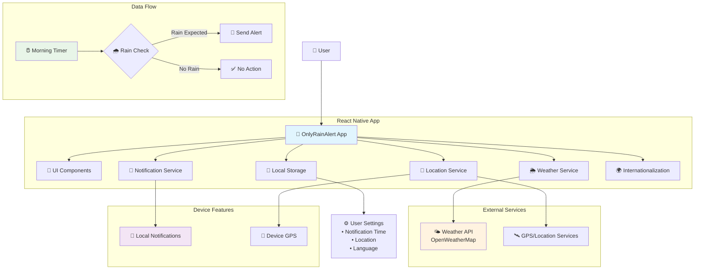
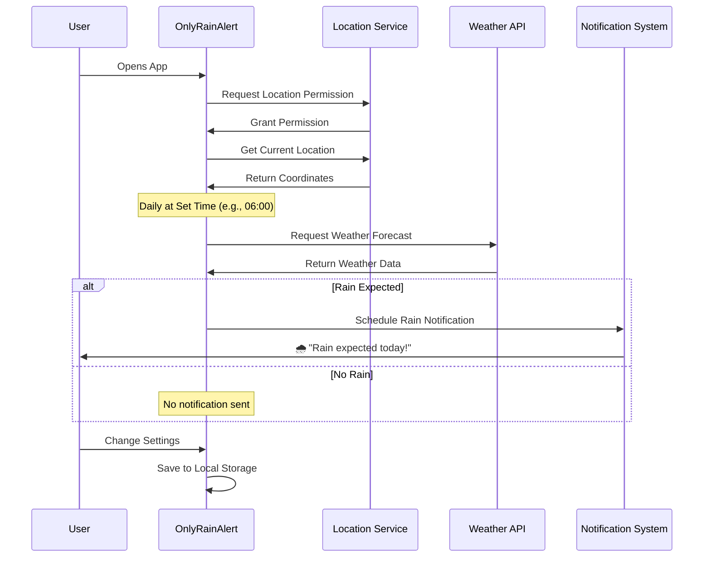

# OnlyRainAlert ☔️

A simple and fast React Native app that sends morning notifications only on rainy days.

## 🏗️ System Architecture



## 🔄 Data Flow



## 🌟 Features

- **Simple & Fast**: Minimal design with optimal performance
- **Smart Notifications**: Only notifies when rain is expected in your area
- **Customizable Time**: Set your preferred morning notification time (default: 06:00)
- **Global Support**: Works worldwide with local weather data
- **Free to Use**: Basic functionality available at no cost
- **Monetization Ready**: Premium features for enhanced experience

## 📱 Screenshots

_Coming soon..._

## 🛠️ Tech Stack

- **React Native**: Cross-platform mobile development
- **Weather API**: Real-time weather data integration (OpenWeatherMap)
- **Push Notifications**: Local notification system
- **Internationalization**: Multi-language support (i18next)
- **Location Services**: GPS-based location detection
- **Local Storage**: AsyncStorage for user preferences

## 🚀 Getting Started

### Prerequisites

- Node.js (v16 or higher)
- React Native CLI
- Android Studio / Xcode

### Installation

```bash
# Clone the repository
git clone https://github.com/wwlapaki310/OnlyRainAlert.git

# Navigate to project directory
cd OnlyRainAlert

# Install dependencies
npm install

# For iOS
cd ios && pod install

# Run the app
npx react-native run-android
# or
npx react-native run-ios
```

## 📋 Development Roadmap

See [Issues](https://github.com/wwlapaki310/OnlyRainAlert/issues) for detailed development tasks.

## 🌍 Supported Languages

- English
- 日本語 (Japanese)
- More languages coming soon...

## 💡 Contributing

Contributions are welcome! Please feel free to submit a Pull Request.

## 📄 License

This project is licensed under the MIT License - see the [LICENSE](LICENSE) file for details.

## 📞 Support

For support, please create an issue in this repository.

---

**Built with ❤️ for people who want to stay dry** 🌂